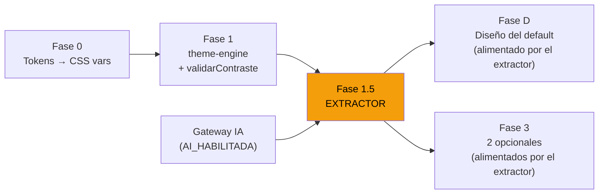

# ESPECIFICACIÓN — Extractor de Estética Visual (Módulo IA)

> **Documento padre:** [`PLAN_DE_IMPLEMENTACION_UI_POR_MODULO.md`](./PLAN_DE_IMPLEMENTACION_UI_POR_MODULO.md) — el plan de ejecución de temas.
> **Se apoya en:** [`ESPECIFICACION_IA_LOCAL_Y_MULTIMODAL.md`](../07-ia-local/ESPECIFICACION_IA_LOCAL_Y_MULTIMODAL.md) (capacidad IA del ERP), [`BRIEF_DE_EXTRACCION_VISUAL.md`](./BRIEF_DE_EXTRACCION_VISUAL.md) (los 11 tokens y el prompt), [`PROPUESTA_APARIENCIA_POR_MODULO_V4.md`](./PROPUESTA_APARIENCIA_POR_MODULO_V4.md) (arquitectura de temas).
> **Regla dura vigente:** NO SE TOCA EL ERP INSTALADO Y CORRIENDO. NO SE TOCA EL POS QUE CORRE.
> **Alcance:** SOLO el nuevo POS (`../NUEVO-POS/`). El extractor vive en el módulo de IA del nuevo ERP.
> **Creado:** 28 Sep 2026.
> **Estado:** PROPUESTA — pendiente de aprobación del dueño.

---

## 0. Origen de la idea

**Frase del dueño (28 Sep 2026):**

> *"Se me ocurre que el módulo de IA tenga una función de extracción de valores de UI: que ahí tenga un selector de a qué módulo va, un campo que permita seleccionar una imagen bajada de Pinterest, y al darle 'Extraer' extraiga los valores para recrear esa estética. Luego podamos decidir cómo llamar a esa estética y a dónde inyectar esa estética."*

### 0.1 Los 2 problemas que resuelve

| # | Problema | Cómo lo resuelve |
|---|---|---|
| 1 | **Diseñar 3 temas desde cero es difícil.** El dueño quiere diseñar el default visual del POS (Fase D) pero no es diseñador. Elegir 6 colores, 3 radios y 2 tipografías desde cero es un ejercicio abstracto. | **Sube una imagen de una UI que le guste → la IA extrae los 11 valores → se calibran y se aplican.** El dueño comunica su gusto con una imagen, no con hex codes. |
| 2 | **Si al admin no le gustan los 3 temas prearmados, no tiene salida.** Hoy el plan ofrece 1 default + 2 opcionales. Si ninguno le gusta, no hay nada que hacer. | **El admin sube una imagen → genera un tema nuevo → lo asigna como default u opción.** El límite de 3 temas ofrecidos se mantiene, pero ahora puede _crear_ los que quiera y _elegir_ cuáles 3 ofrecer. |

### 0.2 Lo que esta idea NO es

- **No es un generador de UIs.** No genera código, no dibuja pantallas. Solo extrae los 11 tokens de apariencia.
- **No es un "modo Pinterest".** No navega Pinterest, no descarga imágenes. El usuario baja la imagen a su ordenador y la sube manualmente.
- **No rompe la regla de 3 temas.** El módulo sigue ofreciendo máximo 3 al cajero. El extractor permite _crear_ temas nuevos que luego se asignan a una de las 3 posiciones.
- **No toca el ERP.** Vive en el módulo de IA del nuevo ERP, separado.

---

## 1. Dónde encaja en la arquitectura existente

### 1.1 El flujo completo (de la imagen al POS)

```
┌──────────────┐     ┌────────────────┐     ┌────────────────┐     ┌─────────────┐
│   Imagen     │     │   Módulo IA    │     │  theme-engine  │     │  Módulo POS │
│  (Pinterest, │────▶│  Extractor de  │────▶│  validar       │────▶│  Aplicar    │
│   Dribbble,  │     │  Estética      │     │  Contraste     │     │  tema       │
│   captura)   │     │  Visual        │     │  + Calibrar    │     │             │
└──────────────┘     └────────────────┘     └────────────────┘     └─────────────┘
     INPUT              EXTRACCIÓN            VALIDACIÓN              INYECCIÓN
     (imagen)           (11 tokens)           (WCAG AA)              (CSS vars)
```

### 1.2 Qué piezas ya existen

| Pieza | Estado | Referencia |
|---|---|---|
| **Los 11 tokens** (6 colores + 3 radios + 2 fuentes) | ✅ Ya definidos | [`BRIEF_DE_EXTRACCION_VISUAL.md`](./BRIEF_DE_EXTRACCION_VISUAL.md) §2 |
| **El prompt estructurado** | ✅ Ya escrito | [`BRIEF_DE_EXTRACCION_VISUAL.md`](./BRIEF_DE_EXTRACCION_VISUAL.md) §5 |
| **La plantilla de ficha manual** | ✅ Ya escrita | [`PLANTILLA_EXTRACCION_REFERENCIAS_PINTEREST.md`](./PLANTILLA_EXTRACCION_REFERENCIAS_PINTEREST.md) |
| **El catálogo de 5 tipografías** | ✅ Ya curado | [`PROPUESTA_BRANDING_TRANSVERSAL.md`](./PROPUESTA_BRANDING_TRANSVERSAL_DESDE_VISTA_GENERAL.md) §4.3 |
| **El catálogo de 12 colores institucionales** | ✅ Ya curado | [`PROPUESTA_BRANDING_TRANSVERSAL.md`](./PROPUESTA_BRANDING_TRANSVERSAL_DESDE_VISTA_GENERAL.md) §4.2 |
| **`validarContraste()`** | ⏳ Pendiente (Fase 1 del plan UI) | [`PLAN_DE_IMPLEMENTACION_UI.md`](./PLAN_DE_IMPLEMENTACION_UI_POR_MODULO.md) §5.3 |
| **`aplicarTema()`** | ⏳ Pendiente (Fase 1 del plan UI) | [`PLAN_DE_IMPLEMENTACION_UI.md`](./PLAN_DE_IMPLEMENTACION_UI_POR_MODULO.md) §5.1 |
| **El contrato `TEMA_DEL_MODULO`** | ⏳ Pendiente (Fase 2 del plan UI) | [`PLAN_DE_IMPLEMENTACION_UI.md`](./PLAN_DE_IMPLEMENTACION_UI_POR_MODULO.md) §3 |
| **El gateway de IA** (`AI_HABILITADA`, `AI_LOCAL_URL`) | ✅ Ya implementado | [`ESPECIFICACION_IA_LOCAL.md`](../07-ia-local/ESPECIFICACION_IA_LOCAL_Y_MULTIMODAL.md) §1–§2 |
| **El contrato de visión** (`POST /vision/predict`) | ✅ Ya definido (contrato 17) | [`contracts/registry.py`](../../NUEVO-POS/apps/api/contracts/registry.py#L365) |

### 1.3 Qué piezas son nuevas

| Pieza | Qué es | Dónde vive |
|---|---|---|
| **Endpoint `POST /ia/extraer-estetica`** | Recibe imagen, devuelve 11 tokens + extras + contraste | `apps/api/routers/ia.py` |
| **Pantalla "Extractor de Estética Visual"** | La UI del módulo IA donde el admin sube la imagen | `apps/ia/src/ExtractorEstetica.jsx` |
| **Tabla `temas_generados`** | Almacena los temas extraídos por IA (nombre, tokens, origen, fecha) | migración en `apps/api/migrations/` |

---

## 2. La UX del Extractor (paso a paso)

### 2.1 La pantalla

```
┌─────────────────────────────────────────────────────────────────┐
│  Módulo IA  ›  Extractor de Estética Visual                     │
├─────────────────────────────────────────────────────────────────┤
│                                                                 │
│  Módulo destino:  [ POS ▾ ]                                     │
│                                                                 │
│  ┌───────────────────────────────────────┐                      │
│  │                                       │                      │
│  │   📷  Arrastra una imagen aquí        │   ← dropzone         │
│  │   o haz clic para seleccionar         │   (JPG/PNG, ≤5 MB)   │
│  │                                       │                      │
│  └───────────────────────────────────────┘                      │
│                                                                 │
│  [ 🎨 Extraer estética ]                   ← botón principal    │
│                                                                 │
└─────────────────────────────────────────────────────────────────┘
```

### 2.2 El resultado (tras la extracción)

```
┌─────────────────────────────────────────────────────────────────┐
│  ─── Resultado de la extracción ───                             │
│                                                                 │
│  ┌─── COLORES ────────────────────────────────────────────────┐ │
│  │  acento:       ● #7a8b3c  (confianza: 85%)                │ │
│  │  fondo:        ● #1c1613  (confianza: 92%)                │ │
│  │  fondo-alt:    ● #2a211c  (confianza: 78%)                │ │
│  │  panel:        ● #2a211c  (confianza: 80%)                │ │
│  │  crema:        ● #f5efe3  (confianza: 90%)                │ │
│  │  peligro:      ● #c0392b  (confianza: 65%)                │ │
│  └────────────────────────────────────────────────────────────┘ │
│                                                                 │
│  ┌─── FORMA ─────────────────────────────────────────────────┐  │
│  │  Radios:    20px / 28px / 36px                            │  │
│  │  Fuente UI: Montserrat (confianza: 78%)                   │  │
│  │  Densidad:  Cómoda                                        │  │
│  └───────────────────────────────────────────────────────────┘  │
│                                                                 │
│  ┌─── CONTRASTE (calculado automáticamente) ─────────────────┐  │
│  │  texto/fondo:   13.8:1  ✅ AA                             │  │
│  │  acento/fondo:   4.6:1  ✅ AA                             │  │
│  │  peligro/acento: distinguible  ✅                         │  │
│  └───────────────────────────────────────────────────────────┘  │
│                                                                 │
│  ┌─── SENSACIÓN ─────────────────────────────────────────────┐  │
│  │  3 adjetivos: cálido • artesanal • acogedor               │  │
│  └───────────────────────────────────────────────────────────┘  │
│                                                                 │
│  ⚠️ La fuente "Montserrat" es una aproximación (78%).          │
│     Opciones del catálogo: [ Montserrat ▾ ]                     │
│                                                                 │
│  ⚠️ El color de peligro tiene baja confianza (65%).            │
│     Se sugiere: #c0392b → #ef4444 (canónico). [ Aceptar ▾ ]    │
│                                                                 │
│  ───────────────────────────────────────────────────────────    │
│                                                                 │
│  Nombre del tema: [ Panadería Cálida________________ ]          │
│                                                                 │
│  Inyectar como:                                                 │
│    ○ Default del POS                                            │
│    ○ Opción 1 del POS                                           │
│    ○ Opción 2 del POS                                           │
│    ○ Guardar sin asignar (biblioteca)                           │
│                                                                 │
│  [ 👁️ Vista previa en vivo ]  [ 💾 Guardar e inyectar ]        │
│                                                                 │
└─────────────────────────────────────────────────────────────────┘
```

### 2.3 El flujo completo (9 pasos)

| Paso | Quién | Qué hace | Qué produce |
|---|---|---|---|
| 1 | Admin | Navega Pinterest/Dribbble y descarga una imagen de una UI que le guste | Archivo JPG/PNG en su ordenador |
| 2 | Admin | Abre el módulo IA → Extractor de Estética Visual | Pantalla del extractor |
| 3 | Admin | Selecciona el módulo destino (ej: POS) | `modulo_destino = 'pos'` |
| 4 | Admin | Sube la imagen (drag & drop o selector de archivos) | Imagen en memoria |
| 5 | Admin | Presiona "Extraer estética" | `POST /ia/extraer-estetica` |
| 6 | IA | Analiza la imagen con el prompt estructurado (§3.2) | 11 tokens + extras + confianzas |
| 7 | Sistema | Pasa `validarContraste()` automáticamente | Resultado con ✅ o ⚠️ por token |
| 8 | Admin | Revisa, ajusta lo que la IA no pudo (fuente, peligro), nombra el tema, elige dónde inyectar | Tema validado y nombrado |
| 9 | Sistema | Guarda en `temas_generados`, escribe el archivo `.js` del tema, actualiza `TEMA_DEL_MODULO` | Tema listo y aplicado |

---

## 3. El contrato técnico

### 3.1 Endpoint: `POST /ia/extraer-estetica`

```
POST /ia/extraer-estetica

Content-Type: multipart/form-data

Campos:
  - imagen:          archivo (JPG/PNG, ≤5 MB)                    [obligatorio]
  - modulo_destino:  string (ej: "pos", "estadisticas")          [obligatorio]

Respuesta 200:
{
  "tokens": {
    "acento":           { "valor": "122 139 60",  "hex": "#7a8b3c", "confianza": 85 },
    "fondo_profundo":   { "valor": "28 22 19",    "hex": "#1c1613", "confianza": 92 },
    "fondo_profundo_alt": { "valor": "42 33 28",  "hex": "#2a211c", "confianza": 78 },
    "fondo_panel":      { "valor": "42 33 28",    "hex": "#2a211c", "confianza": 80 },
    "crema_ticket":     { "valor": "245 239 227", "hex": "#f5efe3", "confianza": 90 },
    "peligro":          { "valor": "192 57 43",   "hex": "#c0392b", "confianza": 65 }
  },
  "forma": {
    "radio_pequeno": "20px",
    "radio_medio":   "28px",
    "radio_grande":  "36px"
  },
  "tipografia": {
    "fuente_ui":     { "sugerida": "Montserrat", "confianza": 78, "catalogo": ["Inter", "Roboto", "Montserrat", "Nunito", "Poppins"] },
    "fuente_ticket": { "sugerida": "ui-monospace", "confianza": 95, "catalogo": ["ui-monospace"] }
  },
  "contraste": {
    "texto_fondo":    { "ratio": 13.8, "pasa_aa": true },
    "acento_fondo":   { "ratio": 4.6,  "pasa_aa": true },
    "peligro_acento": { "distinguible": true }
  },
  "extras": {
    "sombras":   "suaves",
    "bordes":    "sin bordes visibles",
    "densidad":  "cómoda",
    "iconos":    "línea",
    "adjetivos": ["cálido", "artesanal", "acogedor"]
  },
  "advertencias": [
    { "campo": "peligro",   "tipo": "baja_confianza", "mensaje": "Confianza 65%. Se sugiere #ef4444 (canónico)." },
    { "campo": "fuente_ui", "tipo": "aproximacion",   "mensaje": "No se puede confirmar la fuente desde una imagen. Se sugiere Montserrat." }
  ]
}

Errores:
  - 400 si la imagen está vacía o excede 5 MB.
  - 400 si modulo_destino no es un módulo conocido.
  - 503 si la IA no está disponible (AI_HABILITADA = false).
```

### 3.2 El prompt interno (basado en el Brief existente)

El endpoint usa internamente el prompt del [`BRIEF_DE_EXTRACCION_VISUAL.md`](./BRIEF_DE_EXTRACCION_VISUAL.md) §5, pero lo empaqueta como llamada al motor de IA:

```python
# apps/api/routers/ia.py (pseudocódigo)
async def extraer_estetica(imagen: UploadFile, modulo_destino: str):
    # 1. Validar imagen (tamaño, formato)
    # 2. Enviar al motor de IA con el prompt estructurado
    resultado = await motor_ia.analizar_imagen(
        imagen=imagen,
        prompt=PROMPT_EXTRACCION_ESTETICA,  # el del Brief §5
        formato_salida="json_estructurado",
    )
    # 3. Normalizar tokens a canales RGB
    tokens = normalizar_a_canales_rgb(resultado.tokens)
    # 4. Validar contraste WCAG
    contraste = validar_contraste(tokens)
    # 5. Mapear fuente al catálogo cerrado
    fuente = mapear_a_catalogo(resultado.fuente_sugerida, CATALOGO_FUENTES)
    # 6. Devolver resultado estructurado
    return ExtraccionEstetica(tokens=tokens, contraste=contraste, ...)
```

### 3.3 La tabla `temas_generados`

```sql
CREATE TABLE temas_generados (
    id              UUID PRIMARY KEY DEFAULT gen_random_uuid(),
    nombre          VARCHAR(100) NOT NULL,         -- "Panadería Cálida"
    modulo_destino  VARCHAR(50) NOT NULL,           -- "pos"
    tokens          JSONB NOT NULL,                 -- los 11 tokens en canales RGB
    extras          JSONB,                          -- sombras, densidad, adjetivos
    contraste       JSONB NOT NULL,                 -- resultado de validarContraste
    imagen_origen   TEXT,                           -- ruta o referencia de la imagen original
    confianza_media NUMERIC(5,2),                   -- promedio de confianzas
    asignado_como   VARCHAR(20),                    -- "default" | "opcion_1" | "opcion_2" | NULL
    creado_en       TIMESTAMP WITH TIME ZONE DEFAULT now(),
    creado_por      UUID,                           -- usuario que lo generó
    version         INTEGER DEFAULT 0               -- bloqueo optimista (C-04)
);
```

**Correcciones estructurales aplicadas:** C-01 (UUID), C-02 (timezone), C-04 (version).

---

## 4. Las 5 reglas del extractor

| # | Regla | Por qué |
|---|---|---|
| **EX-01** | **La IA da dirección, no valores exactos.** Los hex son aproximados. Los valores finales se calibran con `validarContraste()`. | Un JPEG comprime; la pantalla altera brillo y perfil de color. |
| **EX-02** | **Las tipografías se mapean al catálogo cerrado (5 fuentes).** La IA sugiere "parece Montserrat" y el usuario confirma del catálogo. | La IA no puede identificar fuentes con certeza desde una imagen. |
| **EX-03** | **El módulo sigue ofreciendo máximo 3 temas al cajero.** El extractor permite _crear_ temas; el admin _elige_ cuáles 3 asignar. | La regla de 3 temas es del plan UI (§3.1); el extractor no la rompe. |
| **EX-04** | **Ningún tema se aplica sin pasar `validarContraste()`.** Si no pasa WCAG AA, el sistema sugiere ajustes y avisa. | Nunca se muestra texto ilegible. La legibilidad gana sobre la estética. |
| **EX-05** | **El extractor requiere `AI_HABILITADA = true`.** Si la IA no está disponible, el extractor no aparece en el módulo. El proceso manual (Brief + Plantilla) sigue siendo la alternativa. | Regla de oro heredada de D-1: si la IA no está, nada se rompe. |

---

## 5. Los 4 escenarios de caída del extractor

| Escenario | Qué pasa | Qué ve el admin | Alternativa |
|---|---|---|---|
| **La IA no está disponible** | `AI_HABILITADA = false` | El botón "Extractor" no aparece en el módulo IA | Proceso manual: Brief + Plantilla de ficha |
| **La imagen no es una UI** | La IA no puede extraer tokens coherentes | "No se pudieron extraer valores de esta imagen. Prueba con una captura de una interfaz de POS." | Subir otra imagen |
| **Los colores no pasan contraste** | `validarContraste()` falla | Se muestran los ⚠️ con sugerencias de ajuste; el admin puede aceptar las sugerencias o ajustar manualmente | Ajustar tokens manualmente antes de guardar |
| **El motor de IA tarda demasiado** | Timeout (`AI_LOCAL_TIMEOUT`, default 30s) | "La extracción tardó demasiado. Intenta con una imagen más pequeña o inténtalo de nuevo." | Reintentar o usar proceso manual |

---

## 6. Integración con las fases del Plan de Implementación UI

### 6.1 Dónde se inserta en la secuencia

El extractor se integra como **Fase 1.5** (entre el motor mínimo y el tema default) y como **herramienta de la Fase D** (diseño del default):

```
ANTES (secuencia original):
  Fase D (diseño) → Fase 0 (mecanismo) → Fase 1 (motor) → Fase 2 (default) → Fase 3 (opcionales) → Fase 4 (selector) → Fase 5 (branding)

DESPUÉS (con el extractor integrado):
  Fase D (diseño)  ─────────────────────────────────────────────────────┐
  Fase 0 (mecanismo) → Fase 1 (motor) → Fase 1.5 (EXTRACTOR) → Fase 2 → Fase 3 → Fase 4 → Fase 5
                                              │                     ▲
                                              └─ alimenta la ──────┘
                                                 Fase D y la Fase 3
```

**Lo que cambia:**

| Fase | Cambio | Impacto |
|---|---|---|
| **Fase D** | Ya no es puramente manual. El dueño puede subir una imagen de Pinterest → la IA extrae → se calibra → se aprueba. | **Reduce drasticamente el esfuerzo de la Fase D.** |
| **Fase 1** | Se añade `validarContraste()` y `normalizar_a_canales_rgb()` como funciones del `theme-engine`. | Sin cambio conceptual; estas funciones ya estaban planificadas. |
| **Fase 1.5** | **NUEVA.** Se construye el endpoint `POST /ia/extraer-estetica` y la pantalla del extractor. | Es la pieza nueva. |
| **Fase 2** | El `default.js` puede venir de la extracción (Fase D + 1.5) en vez de ser escrito a mano. | El resultado es el mismo; el proceso es más fácil. |
| **Fase 3** | Los 2 temas opcionales pueden venir de 2 extracciones adicionales. | Mismo beneficio que la Fase D. |
| **Fase 4** | Sin cambio. El selector muestra los 3 temas (vengan de donde vengan). | Sin impacto. |

### 6.2 Las tareas de la Fase 1.5 — Extractor de Estética Visual

| # | Tarea | Archivo | Criterio de aceptación |
|---|---|---|---|
| 1.5.1 | Crear la migración de `temas_generados` | `apps/api/migrations/versions/` | La tabla existe con UUID, timezone, versión (C-01, C-02, C-04). |
| 1.5.2 | Crear `POST /ia/extraer-estetica` | `apps/api/routers/ia.py` | Recibe imagen + módulo, devuelve 11 tokens + extras + contraste en JSON. |
| 1.5.3 | Integrar con el motor de IA existente | `apps/api/routers/ia.py` | Usa `AI_LOCAL_URL` y `AI_HABILITADA`. Si IA no disponible → 503. |
| 1.5.4 | Implementar `normalizar_a_canales_rgb()` | `packages/theme-engine/index.js` | Convierte hex a canales RGB (ej: `#7a8b3c` → `122 139 60`). |
| 1.5.5 | Implementar `mapear_a_catalogo()` | `packages/theme-engine/index.js` | Mapea fuente sugerida al catálogo cerrado de 5 fuentes. |
| 1.5.6 | Crear pantalla `ExtractorEstetica.jsx` | `apps/ia/src/ExtractorEstetica.jsx` | Dropzone + resultado + ajustes + nombre + asignación. |
| 1.5.7 | Crear `ThemePreview.jsx` | `apps/ia/src/components/ThemePreview.jsx` | Miniatura del POS con los colores extraídos, para vista previa en vivo. |
| 1.5.8 | Implementar la escritura del tema extraído | `apps/api/routers/ia.py` | `POST /ia/guardar-tema` escribe el archivo `.js` y actualiza `TEMA_DEL_MODULO`. |
| 1.5.9 | Test: extraer de una imagen conocida y validar contraste | `apps/api/tests/test_extractor_estetica.py` | El resultado pasa `validarContraste()` y tiene los 11 tokens. |
| 1.5.10 | Test: la IA no disponible devuelve 503, no rompe nada | `apps/api/tests/test_extractor_estetica.py` | `AI_HABILITADA=false` → 503 limpio; el módulo sigue funcionando. |

**Reversa:** borrar el endpoint, la pantalla y la tabla. Los temas ya generados e inyectados **se quedan** (son archivos `.js` independientes). El módulo POS sigue funcionando con sus temas estáticos.

### 6.3 Cómo se usa el extractor en la Fase D (el diseño del dueño)

La Fase D original tenía 6 tareas manuales. Con el extractor, se añade una **vía alternativa**:

| Tarea original | Vía original (manual) | Vía nueva (con extractor) |
|---|---|---|
| **D.1** El dueño ve el POS actual | Captura o sesión en vivo | Sin cambio |
| **D.2** El dueño define la dirección visual | Nota escrita | **Sube 1-3 imágenes de Pinterest al extractor** |
| **D.3** Definir los 6 valores del default | Tabla escrita a mano | **La IA extrae los valores; el dueño ajusta** |
| **D.4** Definir tipografía y radios | Nota escrita | **La IA sugiere del catálogo; el dueño confirma** |
| **D.5** Calcular el contraste | Tabla WCAG manual | **`validarContraste()` lo calcula automáticamente** |
| **D.6** Aprobar el default | Firma del dueño | Sin cambio (la aprobación sigue siendo humana) |

**Regla nueva:** ambas vías son válidas. El dueño puede usar el extractor, hacer el proceso manual, o combinar ambos (extraer de una imagen y ajustar a mano). La vía del extractor no elimina la manual.

### 6.4 Cómo se usa el extractor en la Fase 3 (los 2 opcionales)

Igual que en la Fase D: el dueño (o el admin) sube 2 imágenes más → la IA extrae → se calibran → se asignan como Opción 1 y Opción 2.

---

## 7. Dependencias (qué debe existir antes)



| Dependencia | Por qué | Estado |
|---|---|---|
| **Fase 0 cerrada** | Sin tokens dinámicos, no hay donde aplicar el tema extraído | ⏳ Pendiente |
| **Fase 1 cerrada** | `validarContraste()` y `aplicarTema()` son necesarios para validar y previsualizar | ⏳ Pendiente |
| **Gateway de IA operativo** | `AI_HABILITADA = true` y `AI_LOCAL_URL` configurado | ✅ Parcial (la infraestructura existe) |

---

## 8. La vista previa en vivo (tarea 1.5.7)

Antes de inyectar, el admin puede ver cómo quedaría el POS con el tema extraído. La vista previa es un **mini POS** (no el POS real) que muestra:

```
┌─────────────────────────────────────────────────────────┐
│  Vista previa — "Panadería Cálida"                      │
├─────────────────────────────────────────────────────────┤
│ ┌──────────┐ ┌──────────┐ ┌──────────┐                 │
│ │ Panadería│ │ Bebidas  │ │Repostería│  ← categorías    │
│ └──────────┘ └──────────┘ └──────────┘                 │
│ ┌────────┐ ┌────────┐ ┌────────┐       ┌─────────────┐ │
│ │  🍞    │ │  🥐    │ │  ☕    │       │ TICKET      │ │
│ │ Concha │ │ Cuerno │ │ Café   │       │             │ │
│ │ $8.00  │ │ $12.00 │ │ $18.00 │       │ Total:      │ │
│ │        │ │        │ │        │       │ $38.00      │ │
│ └────────┘ └────────┘ └────────┘       │             │ │
│                                         │ [COBRAR]    │ │
│                                         └─────────────┘ │
└─────────────────────────────────────────────────────────┘
```

La miniatura usa los **tokens extraídos como variables CSS** y aplica las clases de Tailwind del POS real. Así el admin ve exactamente cómo quedaría antes de comprometerse.

---

## 9. Lo que este plan NO hace

- **No toca el ERP.** Ni el instalado ni el que corre.
- **No toca el POS que corre.** Solo el POS nuevo.
- **No navega Pinterest automáticamente.** El admin baja la imagen a su ordenador y la sube.
- **No genera código de componentes.** Solo extrae los 11 tokens de apariencia.
- **No rompe la regla de 3 temas.** El extractor crea; el admin elige cuáles 3 ofrecer.
- **No reemplaza el proceso manual.** Si la IA no está disponible, el Brief y la Plantilla siguen siendo la vía.
- **No depende de internet.** Si el motor de IA es local (M1), la extracción funciona sin conexión.

---

## 10. Estado

- [x] Idea originada por el dueño (28 Sep 2026).
- [x] Viabilidad técnica confirmada.
- [x] Integración con las fases existentes documentada.
- [x] Contrato técnico definido (endpoint, tabla, respuesta).
- [x] UX del extractor diseñada (pantalla, flujo, vista previa).
- [x] 5 reglas del extractor definidas (EX-01 a EX-05).
- [x] 4 escenarios de caída resueltos.
- [ ] **Aprobación del dueño para integrar al plan.**
- [ ] Ejecución de la Fase 0 y Fase 1 (dependencias).
- [ ] Ejecución de la Fase 1.5 (el extractor).

---

**Fin de la especificación.**
