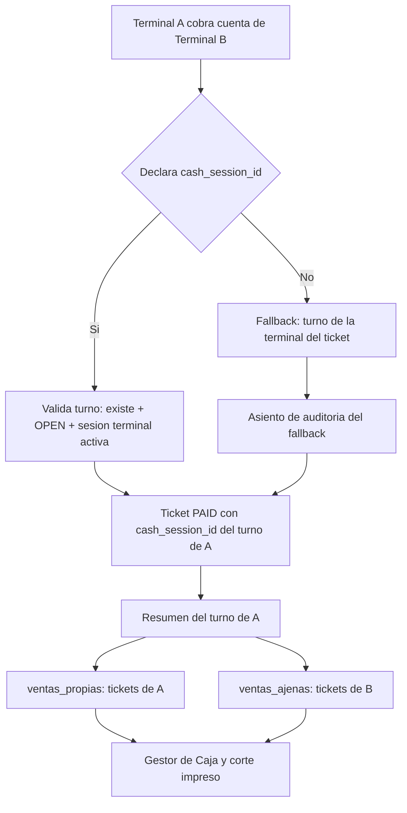

# PLAN — Las 4 observaciones de BUG-08 (deuda técnica y operativa)

> **Origen:** opinión técnica posterior al cierre de BUG-08 (commit `602e594` en `NUEVO-POS`, `9f5cc6a` en `PLANOS`).
> **Estado:** propuesta. No se ha implementado nada de este documento.
> **Principio rector:** ninguna de las 4 observaciones es un bug. Son deudas de nomenclatura, robustez y UX que se resuelven **sin romper contratos** y **sin tocar el comportamiento ya validado** de BUG-08.

---

## 0. Resumen ejecutivo

| # | Observación | Tipo | Riesgo si no se atiende | Prioridad propuesta |
|---|---|---|---|---|
| 1 | `cash_session_id` es nombre heredado y engañoso | Nomenclatura | Confusión de desarrolladores futuros | Baja (documentar) |
| 2 | El fallback silencioso puede esconder bugs | Robustez | Un bug de frontend se disfraza de error de negocio | Media |
| 3 | La validación RN-24 sobre la terminal del turno es sutil | Documentación | Un dev futuro la borra sin saber por qué | Baja (documentar) |
| 4 | ¿Quién cuadra la caja? El corte no explica el cobro ajeno | UX operativa | La cajera no entiende su corte | Alta |

**Recomendación de secuencia:** 4 → 2 → 1 → 3. La #4 es la única con impacto directo en la operación diaria; las otras tres son blindaje contra el futuro.

---

## 1. Observación 1 — El nombre `cash_session_id` es heredado y engañoso

### 1.1 El problema
En el nuevo POS el vocabulario canónico es **"turno de caja"** (RN-49, RN-53, RN-55, el Gestor de Caja, el resumen del turno). Pero el campo que viaja en el contrato 33 se llama `cash_session_id`, por paridad con el viejo POS. Un desarrollador que lea `cash_session_id` pensará en "sesión" (término de terminal, RN-01/RN-24), no en "turno de caja".

### 1.2 Por qué NO se renombra ahora
- Renombrar el campo **rompe el contrato 33** (`pos.cobrar_ticket`) y obliga a tocar frontend + backend + tests a la vez.
- El viejo POS seguiría mandando `cash_session_id` durante la convivencia en paralelo → habría que aceptar **ambos** nombres, lo que empeora la confusión.
- Es exactamente la misma clase de deuda que BUG-02/BUG-03 (nomenclatura heredada). El proyecto ya decidió **no renombrar** esas (ver `DECISIONES_ARQUITECTONICAS_DEL_NUEVO_POS.md` §7, nota de nomenclatura).

### 1.3 Qué SÍ hacer (barato y sin romper nada)
- **1.3.1** Añadir al contrato 33 en [`registry.py`](../../NUEVO-POS/apps/api/contracts/registry.py) una nota explícita: *"`cash_session_id` es el nombre heredado del viejo POS; en el vocabulario del nuevo POS es el **turno de caja** de la terminal que cobra (RN-49/RN-53)."*
- **1.3.2** Añadir la misma nota al docstring de [`CobrarTicketEntrada`](../../NUEVO-POS/apps/api/schemas.py) (ya tiene un comentario BUG-08; ampliarlo con la aclaración de vocabulario).
- **1.3.3** Registrar la deuda en el inventario de deudas de nomenclatura (junto a BUG-02/BUG-03) para que sea localizable.
- **1.3.4** (Opcional, futuro) Si algún día se hace un contrato v2, el campo se llamaría `turno_caja_id` y se aceptarían ambos durante una ventana de transición.

### 1.4 Criterio de cierre
El término "turno de caja" aparece explícitamente asociado a `cash_session_id` en el contrato 33 y en el esquema. Un dev que lea el contrato entiende que son sinónimos.

---

## 2. Observación 2 — El fallback silencioso puede esconder bugs

### 2.1 El problema
En [`cobrar_ticket()`](../../NUEVO-POS/apps/api/routers/pos.py:562) el `else` cae al comportamiento viejo (turno de la terminal del ticket) **sin dejar rastro**. Si un bug de frontend futuro deja de mandar `cash_session_id`, el síntoma reaparece como *"No hay turno de caja abierto para esta terminal"* — un error de negocio que oculta la causa real (el frontend no declaró el turno).

### 2.2 Opciones evaluadas

| Opción | Descripción | Veredicto |
|---|---|---|
| A. Modo estricto | Exigir `cash_session_id` siempre (400 si falta) | ❌ Rompe retrocompatibilidad con el viejo POS en paralelo |
| B. Log de auditoría | Registrar cuándo se usa el fallback | ✅ Recomendada |
| C. Warning en respuesta | Devolver un campo `aviso` en la salida | ⚠️ Contamina el contrato de salida |
| D. Flag de configuración | `POS_ESTRICTO_TURNO_CAJA=true` activa el modo estricto | ✅ Complementaria a B |

### 2.3 Qué hacer (recomendado: B + D)
- **2.3.1 (B)** Cuando se use el fallback, insertar un asiento en [`PosAuditLog`](../../NUEVO-POS/apps/api/models/audit.py) con:
  - `endpoint = "POST /pos/tickets/{id}/pay"`
  - `extras = {"motivo": "fallback_turno_de_la_terminal_del_ticket", "ticket_id": ..., "terminal_id": ...}`
  - `codigo = 200`
  - `terminal_id = ticket.terminal_id`
  Esto respeta RN-75/RN-76 (cada escritura POS se registra) y hace **visible** el fallback en el módulo de Auditoría.
- **2.3.2 (D)** Añadir un flag de entorno `POS_ESTRICTO_TURNO_CAJA` (default `false`). Cuando sea `true`, el `else` lanza `ReglaViolada("RN-49", "El cobro exige declarar el turno de caja (cash_session_id)", 400)`. Sirve para el día de la **cutover** (cuando el viejo POS ya no exista): se activa y el fallback desaparece.
- **2.3.3** Documentar el flag en la ficha y en el contrato 33.

### 2.4 Criterio de cierre
- Existe un test que cobra **sin** `cash_session_id` y verifica que se insertó el asiento de auditoría del fallback.
- Existe un test que, con `POS_ESTRICTO_TURNO_CAJA=true`, cobrar sin `cash_session_id` da 400.
- Con el flag en `false` (default), los 364 tests siguen pasando.

---

## 3. Observación 3 — La validación RN-24 sobre la terminal del turno es sutil

### 3.1 El problema
[`_sesion_caja_por_id_o_400()`](../../NUEVO-POS/apps/api/routers/pos.py:158) hace 3 validaciones. La tercera —*"la terminal del turno debe tener una sesión de terminal activa (RN-24)"*— es la menos obvia: ¿por qué validar la sesión de terminal si ya validamos que el turno está OPEN? Porque un turno de caja puede quedar OPEN mientras la sesión de terminal se cerró (p. ej. la terminal se liberó). Cobrar en ese estado dejaría el dinero en una caja "fantasma".

### 3.2 Qué hacer (documentar, no cambiar código)
- **3.2.1** Ampliar el docstring del helper con un párrafo **"Por qué la validación 3 existe"** con el escenario concreto (turno OPEN + sesión de terminal cerrada).
- **3.2.2** Añadir el mismo razonamiento como comentario en el contrato 33.
- **3.2.3** Añadir a la ficha `FICHA_FIX_BUG08_*` una sección "Las 3 validaciones y por qué cada una".
- **3.2.4** Verificar que el test `test_6_turno_sin_sesion_de_terminal_da_400` tiene un comentario que explica el escenario (no solo el assert).

### 3.3 Criterio de cierre
Un dev que lea el helper entiende por qué hay 3 validaciones y no 2, sin tener que preguntar.

---

## 4. Observación 4 — ¿Quién cuadra la caja? El corte no explica el cobro ajeno

### 4.1 El problema (el más importante)
Con BUG-08, la caja A puede cobrar cuentas de la terminal B. Contablemente es correcto (RN-53: el dinero se cuenta donde entró). Pero en el **corte de caja** la cajera de A verá un `total_ventas` que incluye tickets cuyo `terminal_id` es B. Sin una explicación, la cajera pensará que el sistema está mal, o peor: no podrá conciliar.

Hoy el [`ResumenTurnoSalida`](../../NUEVO-POS/apps/api/schemas.py:561) expone `total_ventas`, `num_transacciones`, etc., pero **no distingue** cuántas de esas ventas fueron de cuentas propias vs. ajenas.

### 4.2 Qué hacer

**Backend — enriquecer el resumen del turno (contrato 12)**
- **4.2.1** Añadir a `ResumenTurnoSalida` dos campos de desglose:
  - `ventas_propias` (Decimal): ventas de tickets cuyo `terminal_id` == la terminal del turno.
  - `ventas_ajenas` (Decimal): ventas de tickets cuyo `terminal_id` != la terminal del turno.
  - (Opcional) `num_transacciones_ajenas` (int).
- **4.2.2** Calcularlos en [`resumen_del_turno()`](../../NUEVO-POS/apps/api/routers/cash.py:333) agrupando los tickets del turno por `terminal_id`. **No** se lee la tabla cruda desde el POS: sigue siendo una proyección del router de caja (frontera A-02).
- **4.2.3** Mantener `total_ventas = ventas_propias + ventas_ajenas` (retrocompatible: los campos nuevos tienen default `0.00`).

**Frontend — mostrarlo en el Gestor de Caja**
- **4.2.4** En [`GestorDeCaja.jsx`](../../NUEVO-POS/apps/pos/src/GestorDeCaja.jsx) mostrar, junto al total de ventas, una línea: *"Incluye $X de cuentas cobradas de otras terminales"* (solo si `ventas_ajenas > 0`).
- **4.2.5** En el corte impreso ([`CorteTicketTemplate.jsx`](../../NUEVO-POS/apps/pos/src/components/CorteTicketTemplate.jsx)) añadir la misma línea, para que quede en el papel que firma la cajera.

**Documentación**
- **4.2.6** Añadir a [`ARQUITECTURA_TERMINALES_Y_CAJA.md`](../../NUEVO-POS/docs/01-logica-del-negocio/ARQUITECTURA_TERMINALES_Y_CAJA.md) §10 una subsección "Cómo se refleja el cobro ajeno en el corte".
- **4.2.7** Añadir una nota operativa (¿en `LECCIONES_DE_UI.md`?) explicando a la cajera qué significa esa línea.

### 4.3 Criterio de cierre
- Un test backend: turno de A cobra 1 cuenta propia + 1 cuenta de B → `ventas_propias` y `ventas_ajenas` cuadran con `total_ventas`.
- Un test frontend: el Gestor de Caja muestra la línea de "cuentas de otras terminales" cuando `ventas_ajenas > 0`, y **no** la muestra cuando es 0.
- El corte impreso incluye la línea.

---

## 5. Orden de ejecución propuesto (todo en una sola tanda o por partes)

### Parte A — Observación 4 (UX operativa, la de mayor valor)
1. Backend: campos `ventas_propias` / `ventas_ajenas` en `ResumenTurnoSalida`.
2. Backend: cálculo en `resumen_del_turno()` + test.
3. Frontend: línea en `GestorDeCaja.jsx` + test.
4. Frontend: línea en `CorteTicketTemplate.jsx` + test.
5. Docs: `ARQUITECTURA_TERMINALES_Y_CAJA.md` §10 + nota operativa.

### Parte B — Observación 2 (robustez)
6. Backend: asiento de auditoría en el fallback + test.
7. Backend: flag `POS_ESTRICTO_TURNO_CAJA` + test.
8. Docs: contrato 33 + ficha.

### Parte C — Observaciones 1 y 3 (documentación)
9. Contrato 33: nota de vocabulario + nota de las 3 validaciones.
10. `CobrarTicketEntrada`: aclaración de vocabulario.
11. Helper `_sesion_caja_por_id_o_400`: párrafo "por qué la validación 3".
12. Ficha: sección "Las 3 validaciones y por qué cada una".
13. Registro de deuda de nomenclatura (junto a BUG-02/03).

### Cierre
14. Suites completas (backend + frontend) sin regresiones.
15. Ficha(s) + ADR si aplica.
16. commit + push (ambos repos).

---

## 6. Qué NO se toca (para no repetir errores)
- **No** se renombra `cash_session_id` (rompería el contrato 33 y la convivencia con el viejo POS).
- **No** se cambia el comportamiento por defecto del fallback (retrocompatibilidad).
- **No** se lee la tabla `tickets` desde el POS (frontera A-02): el desglose se calcula en el router de caja.
- **No** se toca `terminal_id` del ticket (RN-12, ya blindado por BUG-08).
- **No** se modifican las 3 validaciones del helper (solo se documentan).

---

## 7. Diagrama del flujo de cobro con el desglose del corte

---

## 8. Preguntas abiertas para el usuario
1. ¿Se implementan las 4 en una sola tanda, o solo la #4 (la operativa) ahora y el resto después?
2. Para la #2, ¿basta el log de auditoría, o se quiere también el flag `POS_ESTRICTO_TURNO_CAJA` desde ya?
3. Para la #4, ¿la línea del corte debe decir el **nombre** de la terminal de origen (p. ej. "TERM-02") o solo el monto agregado?
