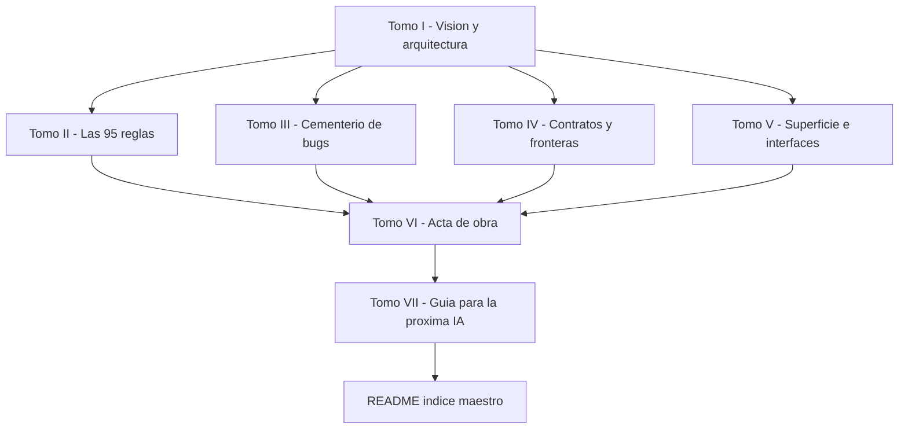

# 📚 PLAN DE LA DOCUMENTACIÓN FINAL DEL NUEVO POS

> **Origen:** §11 del [`PLAN_MAESTRO_DEFINITIVO_POS.md`](../PLAN_MAESTRO_DEFINITIVO_POS.md:1274) — entregable obligatorio.
> **Estado:** PROPUESTA — pendiente de aprobación del dueño antes de redactar los tomos.
> **Regla dura:** el proyecto NO se considera terminado hasta que exista esta documentación.

---

## 0. PROPÓSITO DE ESTE DOCUMENTO

Este documento **no es la documentación final**: es el **plan** que la organiza. Define:

1. **Qué** se va a producir (los 7 tomos y su contenido exacto).
2. **De dónde** sale cada tomo (la fuente real, verificada en el repo).
3. **Cómo** se reconcilian las dos capas (la intención del POS viejo + la realidad construida).
4. **En qué orden** se redacta y **cómo** se verifica que quedó completa.

Se aprueba este plan **antes** de escribir un solo tomo, para no producir 7 documentos con la estructura equivocada.

---

## 1. LAS DOS FUENTES QUE SE FUSIONAN

La documentación final **no es "pegar los dos documentos"**. Es un documento nuevo que integra y reconcilia dos capas:

| Capa | Qué aporta | Dónde vive (verificado) |
|---|---|---|
| **La INTENCIÓN** (POS viejo) | Qué debía hacer el sistema: las 95 reglas, las cicatrices, el cementerio de bugs, las especificaciones funcionales | `ERP-R-DE-RICO` → [`ESPECIFICACIONES DEL PROYECTO/`](../../ERP-R-DE-RICO/ESPECIFICACIONES%20DEL%20PROYECTO/) |
| **La REALIDAD** (construcción) | Qué se construyó de verdad, con qué evidencia, qué se dejó fuera y por qué | `NUEVO-POS` → [`docs/05-plan-de-construccion/FICHA_F*.md`](../../NUEVO-POS/docs/05-plan-de-construccion/) + este repo de planos |

---

## 2. EL PRINCIPIO RECTOR: EL POR QUÉ DE CADA DECISIÓN

> **Cada decisión de diseño debe explicar de dónde viene.** No basta con decir "se hizo así". Hay que decir **por qué necesidad**, **por qué problema**, **por qué circunstancia** surgió.

Toda decisión documentada responde 4 preguntas:

1. **¿Qué problema resolvía?** (la necesidad concreta)
2. **¿En qué circunstancia surgió?** (¿un bug en producción? ¿una limitación técnica? ¿una lección de la batalla?)
3. **¿Qué alternativas se descartaron y por qué?**
4. **¿Cómo se verifica hoy que sigue siendo correcta?** (el test que la protege)

**Ejemplo del nivel de detalle exigido:**

> ❌ **Mal:** "El endpoint devuelve 5 campos."
>
> ✅ **Bien:** "El endpoint devuelve exactamente 5 campos porque en el POS viejo, cuando el pizarrón pedía las cuentas abiertas con todas sus líneas, la respuesta tardaba varios segundos con 8+ cuentas y congelaba la pantalla del cajero (incidente documentado). La solución fue exponer solo la proyección mínima (Regla 15) y leer las líneas solo al recuperar una cuenta concreta. Se verifica con `test_respuesta_ligera_max_5_campos`."

---

## 3. LO QUE NO SE DESECHA (PROHIBIDO TIRAR)

> **Nada de lo siguiente se borra ni se resume "para ahorrar espacio".** Es la memoria del proyecto y su valor principal.

- **El cementerio de bugs** — cada bug resuelto, con su síntoma, su causa raíz y su blindaje actual.
- **Las cicatrices** — los incidentes de producción (T5/CAJA, v6.1 $453, etc.) y qué regla nació de cada uno.
- **Las 95 reglas de negocio (RN-01 a RN-95)** — con su enunciado, su origen y su test. (RN-01..RN-81 heredadas del POS viejo; RN-82..RN-95 nacieron en F8.0 y F9.1.)
- **Las 6 prohibiciones absolutas** — con el caso real que las originó.
- **Las 10 reglas arquitectónicas derivadas de la batalla** — con su historia.
- **Los 16 estándares de calidad (E-01 a E-16)** — con su criterio de verificación.
- **Las decisiones descartadas** — lo que se probó y NO funcionó, y por qué. (Evita que una IA futura lo reintente.)

---

## 4. EL OBJETIVO FINAL: BLINDAR CONTRA LA REPETICIÓN DE ERRORES

> **El propósito es que NINGUNA IA que programe sobre este POS vuelva a cometer los errores del pasado.**

Para lograrlo, la documentación debe ser **legible por una IA sin contexto previo**:

- Cada regla dice **qué prohíbe**, **por qué existe** y **cómo se detecta** si se viola.
- Cada decisión dice **qué se descartó** y **por qué**, para que nadie lo reintente.
- Cada cicatriz dice **qué pasó**, **cuánto costó** y **qué la previene hoy**.
- Los guardianes automáticos (los greps de CI) están documentados como la **aplicación viva** de esas reglas.

**Criterio de éxito:** una IA nueva, leyendo solo esta documentación, debe poder:

1. Entender la arquitectura sin leer todo el código.
2. Saber qué está prohibido y por qué.
3. No reintentar soluciones que ya fallaron.
4. Saber dónde está el test que prueba cada afirmación.

---

## 5. LOS 7 TOMOS — CONTENIDO Y FUENTE REAL

> Los conteos de esta tabla están **verificados contra el repo** (no son los números del §11.5 original, que estaban desactualizados: decía "29 contratos" y "24 interfaces"; el registro real tiene **31 contratos** y **24 interfaces**).

| Tomo | Contenido | Fuente real (verificada) | Artefactos de origen |
|---|---|---|---|
| **I. Visión y arquitectura** | Objetivo, las 6 prohibiciones, las 10 reglas de batalla, los 16 estándares, el principio "de adentro hacia afuera", la frontera por contratos (A-02/O-23), la autonomía vs. observabilidad | [`PLAN_MAESTRO_DEFINITIVO_POS.md`](../PLAN_MAESTRO_DEFINITIVO_POS.md:1) §1–§5, §10 | Plan Maestro, [`DIRECTRICES_TRANSVERSALES_DEL_ERP.md`](../DIRECTRICES_TRANSVERSALES_DEL_ERP.md), [`PLANO ARQUITECTONICO PARA EL NUEVO POS.md`](../PLANO%20ARQUITECTONICO%20PARA%20EL%20NUEVO%20POS.md) |
| **II. Las 95 reglas de negocio** | RN-01 a RN-95, cada una con enunciado + origen + test | [`rules/registry.py`](../../NUEVO-POS/apps/api/rules/registry.py:1) (95 reglas) + [`test_f3_comportamiento.py`](../../NUEVO-POS/apps/api/tests/test_f3_comportamiento.py:1) | Especificación funcional vieja + `LAS_81_REGLAS` + RN-82..RN-95 (F8.0/F9.1) |
| **III. El cementerio de bugs y las cicatrices** | Cada bug/incidente: síntoma, causa raíz, blindaje actual, regla que nació | Fichas de fase + [`HALLAZGOS_AUDITORIA_BRECHAS_POS.md`](../HALLAZGOS_AUDITORIA_BRECHAS_POS.md:1) + [`AUDITORIA_POS_VIEJO_VS_NUEVO.md`](../AUDITORIA_POS_VIEJO_VS_NUEVO.md) + [`FICHA_F10_PARIDAD.md`](../../NUEVO-POS/docs/05-plan-de-construccion/FICHA_F10_PARIDAD.md) | Documentación vieja + fichas F10/F12 |
| **IV. Contratos y fronteras** | Los **31 contratos**, con número, firma, garantías y errores | [`contracts/registry.py`](../../NUEVO-POS/apps/api/contracts/registry.py:1) (31 `Contrato(...)`) | [`CONTRATOS_ENTRE_MODULOS_DEL_NUEVO_POS.md`](../CONTRATOS_ENTRE_MODULOS_DEL_NUEVO_POS.md) + [`FICHA_F2_FRONTERA_DE_CONTRATOS.md`](../../NUEVO-POS/docs/05-plan-de-construccion/FICHA_F2_FRONTERA_DE_CONTRATOS.md) |
| **V. Superficie e interfaces** | Las **24 interfaces** declaradas (7 pantallas raíz + 6 modales + 5 paneles + 4 composición + 2 impresión), los 6 flujos, la paleta canónica, los 3 modos responsivos | [`superficie/registry.py`](../../NUEVO-POS/apps/api/superficie/registry.py:1) (24 `Interfaz(...)`) | [`ESPECIFICACION_DE_INTERFACES_POS.md`](../ESPECIFICACION_DE_INTERFACES_POS.md) + [`ESPECIFICACION_RESPONSIVA_Y_ERGONOMIA_TACTIL.md`](../ESPECIFICACION_RESPONSIVA_Y_ERGONOMIA_TACTIL.md) + [`FICHA_F5_SUPERFICIE.md`](../../NUEVO-POS/docs/05-plan-de-construccion/FICHA_F5_SUPERFICIE.md) |
| **VI. El acta de obra** | Las **84 fichas** de cada sub-fase: qué se construyó, con qué evidencia | [`docs/05-plan-de-construccion/FICHA_F*.md`](../../NUEVO-POS/docs/05-plan-de-construccion/) (84 fichas) | Fichas F1 a F13 + [`FICHA_F11_0_VERIFICACION_PLAN_VS_REALIDAD.md`](../../NUEVO-POS/docs/05-plan-de-construccion/FICHA_F11_0_VERIFICACION_PLAN_VS_REALIDAD.md) |
| **VII. Guía para la próxima IA** | Cómo leer esta documentación, qué está prohibido, dónde está cada test, cómo correr la puerta | Síntesis de los tomos I–VI + [`scripts/guards.mjs`](../../NUEVO-POS/scripts/guards.mjs) | Todo lo anterior |

### 5.1 Nota sobre el Tomo V — las interfaces DESCARTADAS

El §11.5 original hablaba de "15 portadas + 9 DESCARTADAS". El registro real declara **24 interfaces** (todas con ficha y fila de trazabilidad). El Tomo V debe:

- Documentar las **24 interfaces** tal como están en el registro.
- Registrar explícitamente el **defecto del plano** (el "26" era un error aritmético; el contenido enumerado es 24) — ver [`superficie/registry.py`](../../NUEVO-POS/apps/api/superficie/registry.py:33) líneas 33–43.
- Documentar las interfaces que **pertenecen a otros módulos** y por eso NO viven en el POS (p. ej. `SystemSettingsUI`, `NetworkMonitorUI`, `AuditoriaControlUI`), con la decisión de reorganización de módulos de observabilidad ([`PLAN_DE_REORGANIZACION_DE_MODULOS_DE_OBSERVABILIDAD.md`](PLAN_DE_REORGANIZACION_DE_MODULOS_DE_OBSERVABILIDAD.md)).

### 5.2 Nota sobre el Tomo IV — los 31 contratos

El registro tiene **31 entradas `Contrato(...)`** (numeradas 1–31, con la particularidad de que hay números repetidos en el código — 29 aparece dos veces — que el Tomo IV debe reconciliar y documentar como defecto de numeración, no ocultarlo).

---

## 6. ESTRUCTURA DE ARCHIVOS PROPUESTA

Los tomos se escriben en el **repo de planos**, en una carpeta nueva dedicada:

```
PLANOS-ARQUITECTONICOS-DEL-NUEVO-POS/
└── 08-documentacion-final/
    ├── README.md                          ← índice maestro + cómo leer
    ├── TOMO_I_VISION_Y_ARQUITECTURA.md
    ├── TOMO_II_LAS_95_REGLAS_DE_NEGOCIO.md
    ├── TOMO_III_CEMENTERIO_DE_BUGS_Y_CICATRICES.md
    ├── TOMO_IV_CONTRATOS_Y_FRONTERAS.md
    ├── TOMO_V_SUPERFICIE_E_INTERFACES.md
    ├── TOMO_VI_ACTA_DE_OBRA.md
    └── TOMO_VII_GUIA_PARA_LA_PROXIMA_IA.md
```

**Justificación de la carpeta `08-`:** el repo ya usa numeración (`05-plan-de-construccion`, `06-prompt-del-arquitecto`, `07-ia-local`). La documentación final es el entregable de cierre, así que va al final de la secuencia.

---

## 7. ORDEN DE REDACCIÓN Y DEPENDENCIAS



**Racional del orden:**

1. **Tomo I primero** — es el marco conceptual; los demás tomos lo referencian.
2. **Tomos II–V en paralelo** — son catálogos independientes (reglas, bugs, contratos, interfaces).
3. **Tomo VI después** — el acta de obra sintetiza y referencia los tomos II–V.
4. **Tomo VII al final** — la guía de lectura solo tiene sentido cuando todo lo demás existe.
5. **README al cierre** — el índice maestro se escribe cuando ya se conocen los 7 tomos.

---

## 8. CRITERIOS DE ACEPTACIÓN DE LA DOCUMENTACIÓN FINAL

La documentación se considera completa cuando:

- [ ] Existen los **7 tomos** + el README índice.
- [ ] Las **95 reglas** están todas, cada una con enunciado + origen + test (verificable contra [`rules/registry.py`](../../NUEVO-POS/apps/api/rules/registry.py:1)).
- [ ] Los **31 contratos** están todos, con firma y errores (verificable contra [`contracts/registry.py`](../../NUEVO-POS/apps/api/contracts/registry.py:1)).
- [ ] Las **24 interfaces** están todas (verificable contra [`superficie/registry.py`](../../NUEVO-POS/apps/api/superficie/registry.py:1)).
- [ ] Cada decisión responde las **4 preguntas** del §2 (problema, circunstancia, alternativas descartadas, test).
- [ ] El **cementerio de bugs** y las **cicatrices** están completos (nada resumido "para ahorrar espacio").
- [ ] Las **6 prohibiciones** y las **10 reglas de batalla** están con su caso real de origen.
- [ ] Los **16 estándares (E-01 a E-16)** están con su criterio de verificación.
- [ ] El **Tomo VII** permite a una IA sin contexto: entender la arquitectura, saber qué está prohibido, no reintentar lo fallido, y localizar cada test.
- [ ] Cada afirmación tiene **un puntero al test** que la prueba.

---

## 9. LO QUE ESTE PLAN NO HACE (FUERA DE ALCANCE)

- **No modifica código.** La documentación final es un entregable de escritura; no toca `NUEVO-POS/apps/`.
- **No reabre fases cerradas.** F1–F13 están cerradas; este plan solo las documenta.
- **No inventa contenido.** Si una fuente no existe, se registra como hueco, no se rellena.
- **No resume el cementerio de bugs.** Por regla dura (§3), no se comprime.

---

## 10. AUTOCRÍTICA DEL PLAN

1. **Riesgo de duplicación con las fichas.** El Tomo VI podría convertirse en "copiar las 84 fichas". Mitigación: el Tomo VI **sintetiza y referencia**, no copia; el detalle crudo vive en las fichas.
2. **Riesgo de números desactualizados.** El §11.5 original ya tenía números viejos (29 contratos, 24 interfaces con "9 descartadas"). Mitigación: este plan **verificó los conteos contra el repo** (31 contratos, 24 interfaces, 95 reglas, 84 fichas) y los fija como fuente de verdad.
3. **Riesgo de que el Tomo II sea mecánico.** 95 reglas pueden volverse una tabla plana. Mitigación: cada regla debe llevar su **origen** (¿de qué bug/cicatriz nació?), no solo su enunciado.
4. **Riesgo de alcance.** 7 tomos es mucho. Mitigación: el orden del §7 permite entregar valor incremental (Tomo I ya es útil solo).
5. **Riesgo de que la "IA futura" no lo lea.** Mitigación: el Tomo VII es explícitamente una guía de entrada, y el README apunta a él primero.

---

## 11. PRÓXIMO PASO

1. **Aprobación de este plan** por el dueño.
2. Al aprobarse, redactar los tomos en el orden del §7.
3. Al cerrar, verificar los criterios del §8 y commitear en el repo de planos.

> **En una frase:** el POS viejo nos dio el plano y las cicatrices; la construcción nos dio el acta de obra. Al final, ambos se funden en un solo documento que explica **qué es el POS nuevo, por qué es así, y cómo evitar repetir los errores que lo hicieron necesario.**
