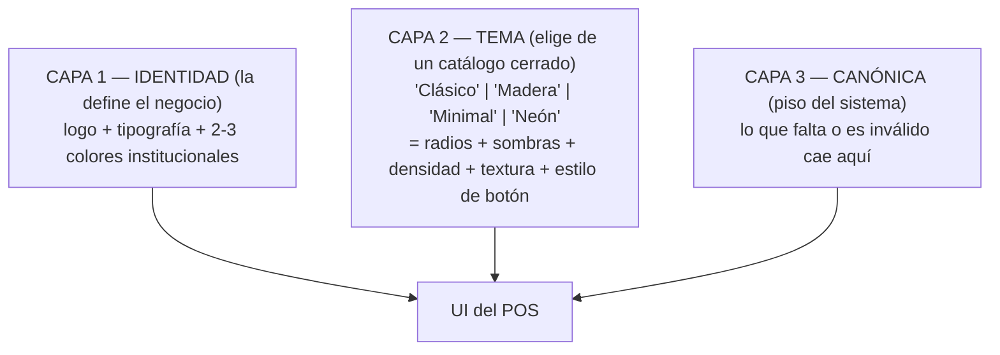

# PROPUESTA — Branding transversal configurable desde Vista General

**Fecha:** 2026-09-26
**Estado:** PROPUESTA v2 (no implementada) — reemplaza la v1
**Regla dura vigente:** NO SE TOCA EL ERP INSTALADO Y CORRIENDO.
**Autor:** sesión de construcción del POS nuevo (etapa P3 cerrada)

---

## 0. Qué cambió de la v1 a la v2

La v1 proponía una paleta plana de 5 colores editables a mano. Tras la revisión con el
usuario, la v2 adopta un **modelo de 3 capas** que separa *identidad* de *tema*, y define
un **catálogo cerrado** (4 temas, 12 colores institucionales, 5 tipografías). El motivo:
pedirle al negocio 5 colores sueltos produce combinaciones ilegibles; pedirle 2-3 colores
institucionales y derivar el resto por contraste produce siempre una UI legible.

---

## 1. La idea, en una frase

Que el módulo **Vista General** del ERP deje de configurar solo *datos* del negocio
(nombre, dirección, teléfono, zona horaria, moneda) y pase a configurar también su
**identidad visual** (logotipo, tipografía, 2-3 colores institucionales y un tema de
estilo), y que el **POS nuevo respete esa identidad** en vez de tener su propio diseño
hardcodeado.

---

## 2. Hallazgo clave: el 70% ya existe

Esta propuesta **no parte de cero**. El ERP ya tiene el patrón exacto, aplicado a medias.
Todo lo siguiente fue verificado leyendo el código, no supuesto:

| Pieza existente | Archivo | Qué demuestra |
|-----------------|---------|---------------|
| Canal genérico de settings | [`apps/api/modules/settings/router.py`](../../ERP-R-DE-RICO/apps/api/modules/settings/router.py:48) | `GET/PATCH /settings/{key}` ya es un sistema clave-valor genérico |
| Branding leído desde settings | [`apps/inventory/services/pwaRuntime.js`](../../ERP-R-DE-RICO/apps/inventory/services/pwaRuntime.js:156) | `derivarBrandingDesdeSettings()` ya lee `business_name` y `theme_color` |
| Manifest PWA reescrito en caliente | [`pwaRuntime.js`](../../ERP-R-DE-RICO/apps/inventory/services/pwaRuntime.js:175) | `aplicarBrandingAlManifest()` ya prueba el concepto "la UI se viste desde settings" |
| Vista General ya edita info del negocio | [`apps/ExperimentCenterUI.jsx`](../../ERP-R-DE-RICO/apps/ExperimentCenterUI.jsx:228) | `bizInfo` + `saveBizInfo()` ya persisten 6 claves con `PATCH /settings/{key}` |
| Precedente de "tema" por módulo | [`apps/api/modules/settings/service.py`](../../ERP-R-DE-RICO/apps/api/modules/settings/service.py:126) | `heladeria_display_precios_config` ya guarda `"theme":"LIGHT"` como JSON |
| Precedente de branding editable | [`service.py`](../../ERP-R-DE-RICO/apps/api/modules/settings/service.py:157) | `heladeria_branding` ya guarda nombre y eslogan editables |
| Paleta canónica declarada | [`apps/api/superficie/registry.py`](../../NUEVO-POS/apps/api/superficie/registry.py:58) | El POS nuevo ya trata el diseño como **dato declarado**, no como código disperso |

**Conclusión del hallazgo:** lo que se propone es **unificar tres esfuerzos dispersos**
(`theme_color`, `heladeria_branding`, `PALETA_CANONICA`) en **un solo sistema de branding
transversal**. No es una ocurrencia suelta: es la conclusión natural de un patrón ya iniciado.

---

## 3. El modelo de 3 capas (el corazón de la v2)



### Capa 1 — Identidad (la define el negocio)

El negocio define **solo 3 cosas**:

1. **Logotipo** (archivo).
2. **Tipografía** (elegida de un catálogo cerrado de 5).
3. **2-3 colores institucionales** (elegidos de una paleta curada de 12).

**El sistema deriva el resto.** De los 2-3 colores institucionales se calculan
automáticamente: fondo, panel, texto y peligro, **por contraste**. El negocio nunca elige
un fondo ilegible porque no elige el fondo: lo deriva el sistema.

### Capa 2 — Tema (catálogo cerrado)

El negocio **no inventa** un tema: elige uno de 4. Cada tema es un **contrato de tokens**
probado (radios, sombras, densidad, textura, estilo de borde y de botón). La textura es
*parte* del tema, no un campo suelto.

### Capa 3 — Canónica (piso del sistema)

Es el **fallback obligatorio**. Si Vista General no responde, si el negocio no ha
configurado nada, o si su combinación no pasa el contraste, la UI cae aquí. **Nunca hay
UI a medias.**

### Regla de fusión (inviolable)

```
UI final = CANÓNICA  ⊕  TEMA  ⊕  IDENTIDAD
```

- La **canónica** es la base completa.
- El **tema** sobreescribe tokens de forma (radios, sombras, densidad, textura).
- La **identidad** sobreescribe tokens de color y tipografía.
- Cualquier clave ausente o inválida **cae a la canónica**.
- Si el contraste resultante no pasa **WCAG AA**, se descarta la identidad y se usa la
  canónica, **con aviso visible** (ver §7).

---

## 4. Catálogo cerrado (diseñado en esta propuesta)

### 4.1 Los 4 temas base

Cada tema define **forma**, no color. El color lo aporta la identidad.

| Tema | Carácter | Radios | Sombras | Densidad | Textura | Estilo de botón |
|------|----------|--------|---------|----------|---------|-----------------|
| **Clásico** | Neutro, profesional. El default. | `35/40/50px` (canónicos) | Suaves | Cómoda | Sólida | Relleno con acento |
| **Madera** | Cálido, artesanal. Usa [`wood_bg.jpg`](../../ERP-R-DE-RICO/public/assets/wood_bg.jpg). | `20/28/36px` | Medias, cálidas | Cómoda | Madera (imagen) | Relleno + borde madera |
| **Minimal** | Limpio, mucho aire. | `12/16/20px` | Casi nulas | Amplia | Sólida | Contorno fino |
| **Neón** | Alto contraste, oscuro, vibrante. | `24/32/40px` | Glow del acento | Compacta | Sólida oscura | Relleno + glow |

**Nota:** "Clásico" es exactamente el tema que el POS nuevo ya tiene hoy. Por eso la
canónica y el tema Clásico coinciden: migrar a este modelo **no cambia la UI actual**.

### 4.2 Los 12 colores institucionales curados

El negocio elige 2-3 de estos 12. Todos fueron elegidos para que, combinados con la
derivación automática de fondo/texto, **pasen contraste AA** en el tema Clásico.

| # | Nombre | Hex | Familia |
|---|--------|-----|---------|
| 1 | Verde lima (canónico) | `#c1d72e` | Verde |
| 2 | Verde bosque | `#2f6b3f` | Verde |
| 3 | Azul marino | `#1e3a8a` | Azul |
| 4 | Azul cielo | `#0ea5e9` | Azul |
| 5 | Rojo teja | `#b91c1c` | Rojo |
| 6 | Naranja mandarina | `#ea580c` | Naranja |
| 7 | Ámbar pan | `#d97706` | Naranja |
| 8 | Rosa mexicano | `#db2777` | Rosa |
| 9 | Morado uva | `#7c3aed` | Morado |
| 10 | Turquesa | `#0d9488` | Verde-azul |
| 11 | Café cacao | `#78350f` | Café |
| 12 | Grafito | `#374151` | Neutro |

**Por qué curados y no color-picker libre:** un color-picker libre permite elegir
`#ffff00` como acento sobre fondo blanco, y el POS queda ilegible. La paleta curada
garantiza que cualquier combinación de 2-3 de estos 12 produzca una UI legible.

### 4.3 Las 5 tipografías del catálogo

Todas son **web-safe o de Google Fonts**, con licencia abierta, y ya probadas para
legibilidad en pantalla táctil.

| # | Nombre | Familia | Carácter | Uso ideal |
|---|--------|---------|----------|-----------|
| 1 | **Inter** (canónica) | `Inter, system-ui, sans-serif` | Neutra, moderna | Default |
| 2 | **Roboto** | `Roboto, system-ui, sans-serif` | Neutra, clásica | Corporativo |
| 3 | **Montserrat** | `Montserrat, system-ui, sans-serif` | Geométrica, elegante | Marca premium |
| 4 | **Nunito** | `Nunito, system-ui, sans-serif` | Redondeada, amable | Panadería/café |
| 5 | **Poppins** | `Poppins, system-ui, sans-serif` | Geométrica, moderna | Moderno/juvenil |

**Nota:** la tipografía del **ticket impreso** se mantiene monoespaciada
(`ui-monospace`) por legibilidad térmica, independientemente de la elección de marca.

---

## 5. Lo que falta (actualizado a v2)

| Pieza | Estado hoy | Qué falta |
|-------|-----------|-----------|
| Logotipo | ❌ no existe `business_logo` | clave nueva + carga de archivo + fallback |
| Colores institucionales | ⚠️ solo `theme_color` (1 color) | clave `business_colors` (2-3 de la paleta curada) |
| Tema | ❌ no existe | clave `business_theme` (uno de los 4) |
| Tipografía | ❌ hardcodeada | clave `business_font` (una de las 5) |
| **Que el POS nuevo lo respete** | ❌ **no existe** | **esto es lo nuevo y lo importante** |

---

## 6. Contratos propuestos (borrador, sin implementar)

### 6.1 Claves nuevas en `system_settings`

| Clave | Tipo | Valor por defecto | Descripción |
|-------|------|-------------------|-------------|
| `business_logo` | text (URL/ruta) | `""` | Ruta del logotipo. Vacío = logo estático actual. |
| `business_colors` | json | `[]` | 2-3 colores institucionales de la paleta curada. Vacío = canónica. |
| `business_theme` | text | `"clasico"` | Uno de: `clasico`, `madera`, `minimal`, `neon`. |
| `business_font` | text | `"inter"` | Una de: `inter`, `roboto`, `montserrat`, `nunito`, `poppins`. |

### 6.2 Forma del JSON de colores

```json
{
  "institucionales": ["#c1d72e", "#1e3a8a"],
  "tema": "clasico",
  "fuente": "inter"
}
```

**Regla de derivación:** de los 2-3 colores institucionales el sistema calcula
`fondo`, `panel`, `texto` y `peligro` por contraste. El negocio **no** los elige.

**Regla de fusión:** el JSON del negocio se **fusiona sobre** `PALETA_CANONICA`. Las claves
ausentes o inválidas caen al valor canónico. **Nunca** se aplica una paleta incompleta.

### 6.3 Contrato de lectura (camino A)

```
GET /branding
-> 200 {
     "logo": "…" | null,
     "colors": { "institucionales": [...], "tema": "…", "fuente": "…" } | null,
     "resolved": { "acento": "…", "fondo": "…", "panel": "…", "texto": "…", "peligro": "…" },
     "source": "settings" | "default",
     "warning": null | "contraste_insuficiente"
   }
```

- **Garantía:** si el ERP no responde, el POS nuevo **sirve igual** con `PALETA_CANONICA`
  (mismo principio de degradación elegante que ya usa
  [`pwaRuntime.js`](../../ERP-R-DE-RICO/apps/inventory/services/pwaRuntime.js:145)).
- **Nunca** devuelve un error que rompa el arranque del POS.
- El campo `resolved` es la paleta **ya calculada y validada**; el POS la aplica tal cual.

---

## 7. El aviso (decisión del usuario: punto 4)

El usuario eligió **aviso visible**, no fallback silencioso. El aviso cubre **dos casos**:

1. **Vista General no responde** → "Usando tema por defecto".
2. **La combinación no pasa contraste AA** → "Tu combinación no cumple contraste; usé el
   tema por defecto".

**Diseño del aviso:** discreto, no bloqueante, en el header del POS (una franja fina o un
chip), con opción de descartar. **Nunca** un modal que interrumpa una venta.

---

## 8. Los 3 riesgos reales

### Riesgo 1 — El ERP está corriendo y vendiendo

Tocar [`ExperimentCenterUI.jsx`](../../ERP-R-DE-RICO/apps/ExperimentCenterUI.jsx:228) o
[`settings/service.py`](../../ERP-R-DE-RICO/apps/api/modules/settings/service.py:26) es
**tocar el ERP**, lo que viola la regla dura.

**Mitigación:** construir primero el lado del POS nuevo (aislado). La edición en Vista
General se deja para una fase posterior **con ventana de mantenimiento acordada**.

### Riesgo 2 — El POS nuevo no ve la tabla `system_settings` del ERP

Hoy el POS nuevo tiene **su propia base de datos** (`nuevo_pos`). No ve la del ERP.

**Dos caminos:**

- **(A) Contrato de solo lectura.** El POS nuevo pide el branding al ERP vía un endpoint.
  Encaja con la arquitectura de contratos de F2. Limpio, pero acopla.
- **(B) Replicar las claves de branding** en la BD del POS nuevo y sincronizarlas.
  Más aislado, pero duplica.

**Recomendación:** **(A) ahora** (contrato de lectura, durante la prueba en paralelo) y
**(B) en el corte** (cuando el POS nuevo sea el dueño de sus datos).

### Riesgo 3 — Contraste roto por combinación de colores

Un negocio puede elegir un acento claro sobre un tema claro y romper la legibilidad.

**Mitigación:** la paleta curada de 12 (§4.2) + la derivación automática de fondo/texto +
la validación WCAG AA con fallback a la canónica y aviso (§7). Tres barreras, no una.

---

## 9. Plan por fases

### Fase A — POS nuevo lee branding y lo aplica (AISLADA, cero riesgo para el ERP)

- El POS nuevo consume `GET /branding` (o su equivalente local) y lo aplica como
  variables CSS.
- Si no hay datos, usa `PALETA_CANONICA`.
- **No se toca el ERP.** Se puede probar en vivo en el puerto 5100.

### Fase B — Claves de branding en la BD del POS nuevo (AISLADA)

- Agregar `business_logo`, `business_colors`, `business_theme` y `business_font` a la BD
  `nuevo_pos`, con su seed.
- Permite probar el efecto completo sin depender del ERP.

### Fase C — Edición en Vista General del ERP (CON VENTANA ACORDADA)

- Añadir los campos de logo, colores, tema y tipografía al modal de Vista General.
- Reutilizar el permiso `editar_info_negocio` que **ya existe**
  ([`ExperimentCenterUI.jsx`](../../ERP-R-DE-RICO/apps/ExperimentCenterUI.jsx:560)).
- **Requiere confirmación explícita del usuario antes de tocar el ERP.**

### Fase D — Texturas y tipografía avanzada (OPCIONAL)

- Solo si las fases A–C demuestran valor.
- Es la fase más cara (assets, almacenamiento, validación).

---

## 10. Veredicto

**Viable: sí, totalmente.** Y no es una idea aislada: es la **unificación** de un patrón que
ya existe en tres lugares del ERP y del POS nuevo.

**El modelo de 3 capas es superior a la paleta plana de la v1** porque:
1. El negocio elige **menos** (3 cosas) y obtiene **más** (una UI coherente).
2. El sistema **garantiza** legibilidad por derivación + validación, en vez de confiar en
   el buen gusto del usuario.
3. Los temas son **contratos probados**, no combinaciones aleatorias.

**Único cambio al planteamiento original:** el **orden**. No empezar por el modal del ERP
(que está corriendo y vendiendo), sino por el POS nuevo (que está aislado y es donde se
quiere que el branding se respete). Así el ERP no se toca hasta que el usuario decida abrir
la ventana de mantenimiento.

---

## 11. Estado de esta propuesta

- **Escrita, no implementada.** Ninguna línea de código fue modificada.
- El ERP permanece intacto: HEAD `b0bc297`, árbol limpio, `rderico-*` Up.
- El POS nuevo permanece en su commit `25e5de0`.
- La decisión de avanzar a la Fase A corresponde al usuario.
